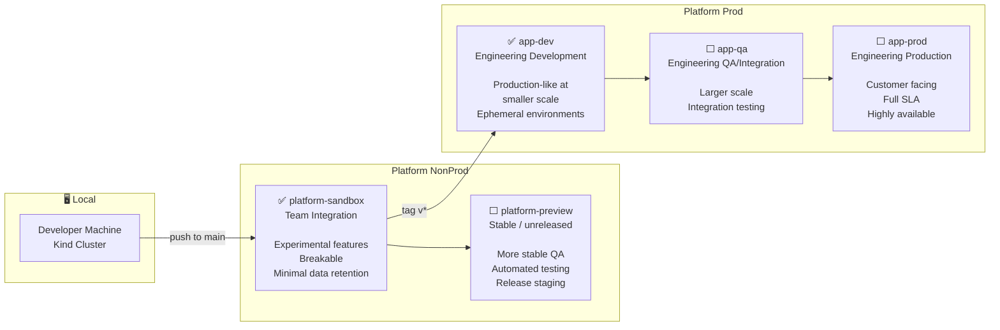
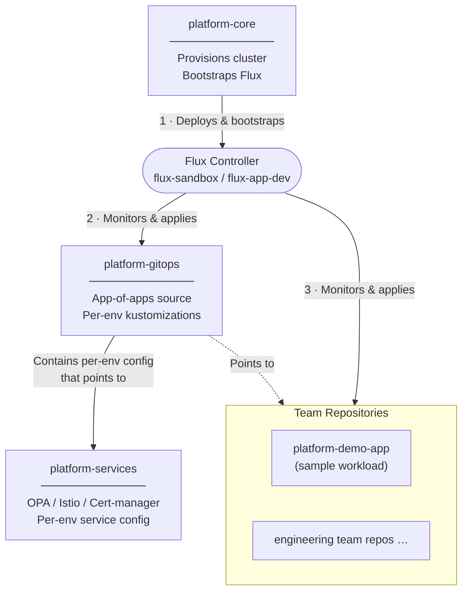

# The Platform Engineer's Handbook - Platform Core

[](https://github.com/tpeh-demo-company/platform-core/actions/workflows/pulumi.yaml)
[](https://github.com/tpeh-demo-company/platform-core/actions/workflows/pulumi-shared.yaml)

Follow-along repository for *The Platform Engineer's Handbook*.

This repo provisions the core platform: a local [kind](https://kind.sigs.k8s.io/) Kubernetes cluster wired for OIDC login against Auth0, bootstrapped with a [Flux](https://fluxcd.io/) operator so it can pull the rest of its configuration from GitOps. A self-hosted GitHub Actions runner drives the pipeline that builds, previews, and applies all of this.

## Prerequisites

| Tool | Purpose |
| ---- | ------- |
| [pulumi](https://www.pulumi.com/docs/get-started/install/) | Infrastructure provisioning |
| [uv](https://docs.astral.sh/uv/getting-started/installation/) | Python dependency manager for Pulumi projects |
| [docker](https://docs.docker.com/get-docker/) | Required to create the kind cluster |
| [kind](https://kind.sigs.k8s.io/docs/user/quick-start/#installation) | Local Kubernetes cluster |
| kubectl + [kubelogin](https://github.com/int128/kubelogin) | Cluster access via OIDC |
| [flux](https://fluxcd.io/flux/installation/) | GitOps operator CLI |
| [bats](https://bats-core.readthedocs.io/) | Infrastructure test runner |
| [bws](https://bitwarden.com/help/secrets-manager-cli/) | Bitwarden Secrets Manager CLI |

You'll also need an Auth0 tenant and a Cloudflare Account — see [`pulumi-shared/README.md`](pulumi-shared/README.md).

**CI setup:** register a self-hosted runner (`RUNNER_TOKEN=<token> pulumi/scripts/start-runner.sh`).

## What's in here

| Path | Description |
| ---- | ----------- |
| [`pulumi/`](pulumi/README.md) | Cluster stack — kind cluster, OIDC config, Flux bootstrap |
| [`pulumi-shared/`](pulumi-shared/README.md) | Shared identity & networking stack — Auth0/OIDC + Cloudflare tunnels. Deploy this first. |


## Environment topology

The full promotion model from *The Platform Engineer's Handbook* spans three tiers. This repo implements the stages marked ✅; the others are out of scope.



## CI/CD pipeline

Two independent workflows, one per Pulumi project. `pulumi-shared.yaml` runs on GitHub-hosted runners, since it only talks to the Auth0 API; `pulumi.yaml` runs on the **self-hosted** runner (`scripts/start-runner.sh`) because it needs Docker to create the kind cluster. Approval gates are plain GitHub Environments with required reviewers — no extra tooling.

```text
pulumi-shared.yaml (push to main, touching pulumi-shared/**)
------------------------------------------------------------------
  [lint] --> [preview-shared] --> (approve-shared) --> [update-shared] --> [validate-shared]
   └─ lint.yaml reusable (black, mypy, ruff, bandit)


pulumi.yaml (push to main touching pulumi/**, or tag v*)
------------------------------------------------------------------
  [lint] --> [pre-flight] --> [deploy-sandbox]
   │          └─ pre-flight.yaml    └─ preview-apply-env.yaml
   │              (kind cluster,        [preview] --> (approve) --> [deploy] --> [validate]
   └─ lint.yaml   OIDC + Cloudflare check)
                                              | tag push only
                                              v
                             [pre-flight-app-dev] --> [deploy-app-dev]
                              └─ pre-flight.yaml      └─ preview-apply-env.yaml
                                                          [preview] --> (approve) --> [deploy] --> [validate]
```

## GitOps architecture

How the repositories relate at runtime (Figure 2.4 from the book, mapped to our repos):



## Related repos

Part of *The Platform Engineer's Handbook* series:

- [**platform-gitops**](https://github.com/Jdavid77/platform-gitops) — the Flux source this cluster reconciles from (app-of-apps pattern).
- [**platform-services**](https://github.com/Jdavid77/platform-services) — OPA/conftest policies and per-environment service config.
- [**platform-demo-app**](https://github.com/Jdavid77/platform-demo-app) — sample workload used to validate the platform end-to-end.
